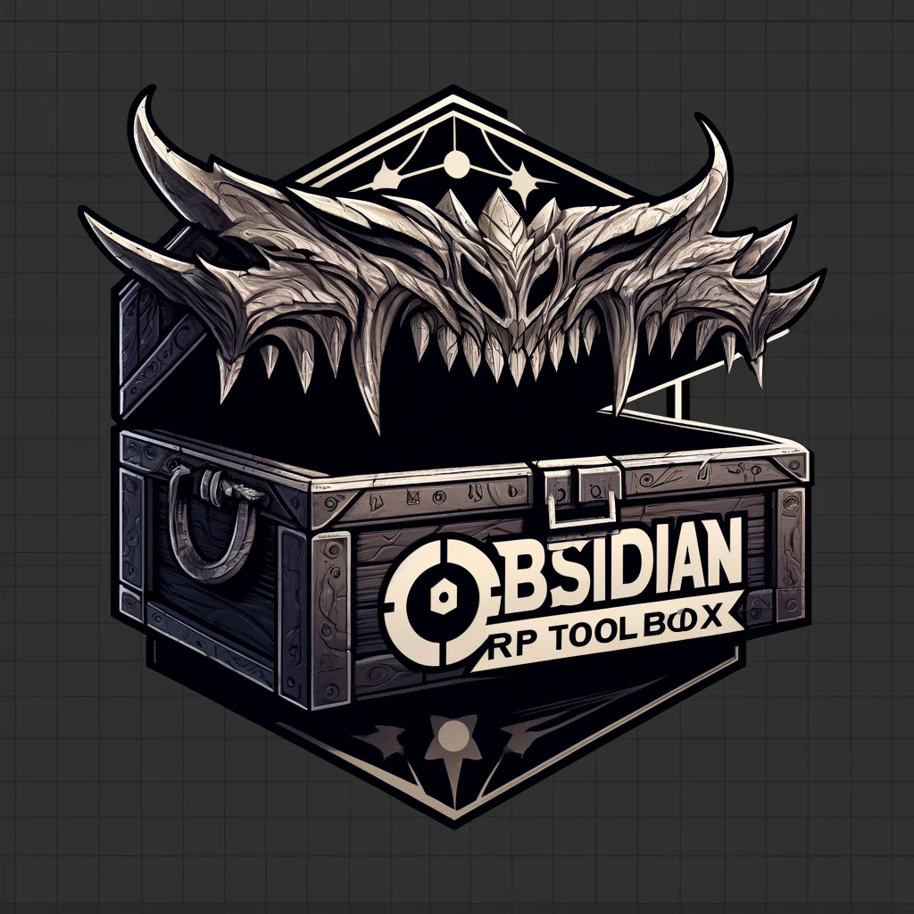
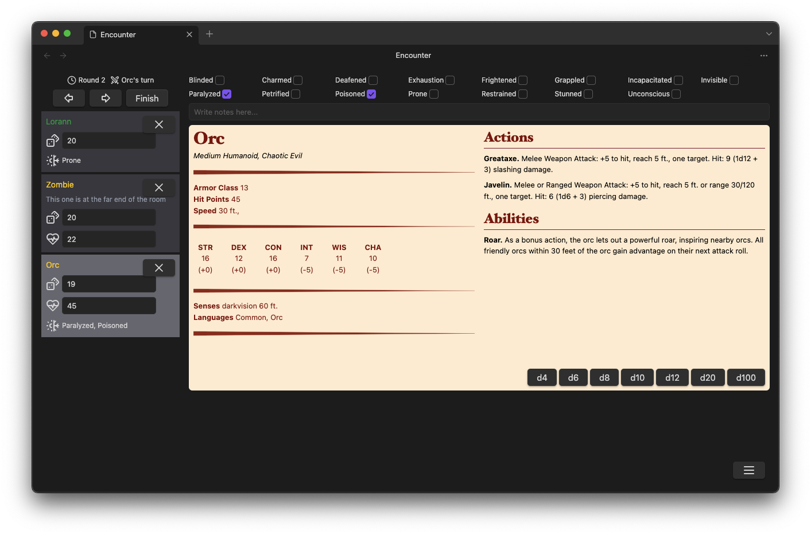

# RP Toolbox

RP Toolbox is a plugin for Obsidian designed to assist with running role-playing campaigns, specifically for DnD 5e. It provides features to generate content for your campaigns using ChatGPT or other language models that can write JSON.

## Installation

To install RP Toolbox, follow these steps:

1. Download the latest `toolbox.zip` from the release assets on the GitHub page.
2. Create a `rp-toolbox` folder in `{pathToYourObsidianVault}/.obsidian/plugins`.
3. Extract the files from `toolbox.zip` into the `rp-toolbox` folder.
4. Make sure you have enabled community plugins in Obsidian.
5. That is it, you should be able to use the plugin now
6. (Optional) You can add your OpenAI API key to the plugin settings to automatically generate content

# Features

- Create 5e monster statblocks
- Create players
- Run encounters

# Usage

- Click the sword ribbon icon to start adding content or run an encounter
- Use the command palette `cmd + p`/`ctrl + p` and write "Insert {your NPC name}" while focused on a note file, it will attach a stat block for the NPC you selected

# Screenshots

